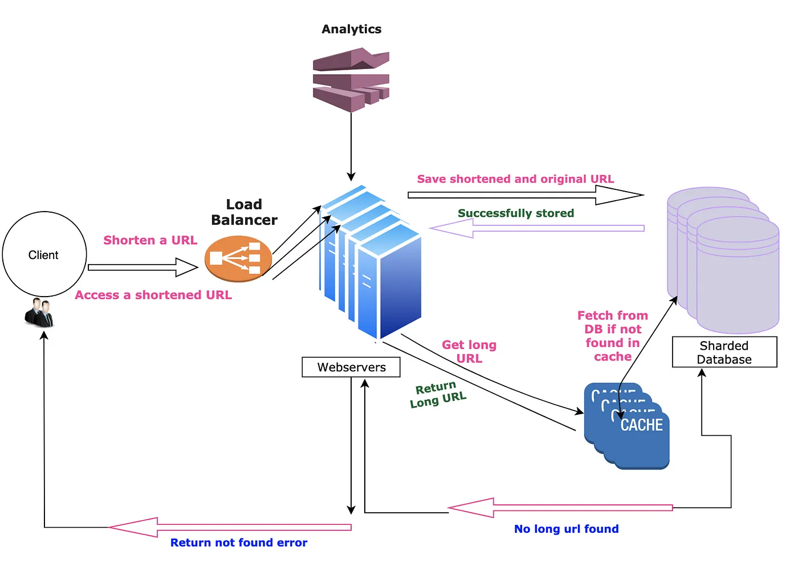

# URL Shortener Service

This project is a URL shortening service, which takes a long URL and shortens it using a hashing algorithm and Base62 encoding. The shortened URL is unique and can be used to redirect to the original URL.

Functional Requirements:

* Service should be able to create shortened url/links against a long url
* Click to the short URL should redirect the user to the original long URL
* Shortened link should be as small as possible
* Service should collect metrics like most clicked links
* Once a shortened link is generated it should stay in system for lifetime

Non-Functional Requirements:

* Service should be up and running all the time
* URL redirection should be fast and should not degrade at any point of time (Even during peak loads)
* Service should expose REST API’s so that it can be integrated with third party applications


High Level Advanced Design:

* Service should be able to handle millions of requests per day
* Service should be able to handle millions of URL’s
* Service should be able to handle millions of users
* Service should be able to handle millions of clicks per day




## Tech Stack

The project uses the following technologies:

- Kotlin
- JDK 17
- Spring Boot 3
- MongoDB
- Spring Data MongoDB
- Docker
- Docker Compose
- Spring Cache

## API Documentation

The API documentation for this service is available via Swagger. You can access it at the `/swagger-ui.html` endpoint of the running application.

## Running the Project

To run the project, you need to have Docker, Docker Compose, and Maven installed on your machine.

You can start the application using the following command:

```bash
mvn spring-boot:run
```

This will start the application and connect it to a MongoDB instance running in a Docker container.

## Docker Compose

To start the MongoDB instance, you can use Docker Compose with the provided `docker-compose.yml` file:

```bash
docker-compose up -d
```

This will start a MongoDB instance in a Docker container and expose it on port 27017.

Please note that the application and the MongoDB instance need to be running on the same network for them to be able to communicate with each other.